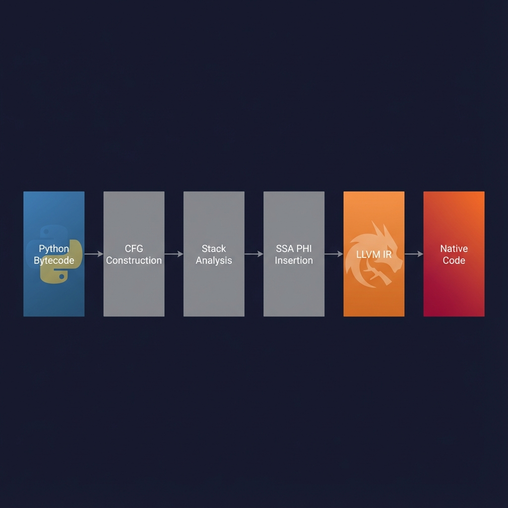

# justjit

[](https://github.com/magi8101/justjit/actions)
[](https://www.python.org/downloads/)
[](https://llvm.org/)
[](LICENSE)

**A from-scratch JIT compiler that lowers Python 3.13 bytecode to native machine code via LLVM IR with full SSA construction and state-machine generator lowering.**

Unlike tracing JITs or template compilers, justjit performs proper control-flow analysis, computes stack liveness across basic blocks, and inserts PHI nodes for correct SSA form. Generators and coroutines are manually lowered to re-entrant C state machines.

---

## Performance

Integer mode achieves up to **23,000x speedup** over CPython for pure numeric loops:

| Benchmark | CPython | Object Mode | Int Mode | Int Speedup |
|-----------|---------|-------------|----------|-------------|
| sum_while(100K) | 4.67 ms | 6.22 ms | 0.20 us | **23,344x** |
| nested_loop(100) | 374.8 us | 563.5 us | 0.20 us | **1,874x** |
| branch_heavy(10K) | 750.6 us | 910.8 us | 4.7 us | **160x** |
| fibonacci(35) | 1.5 us | 2.2 us | 0.30 us | **5x** |

Run `python benchmark.py` to reproduce.

---

## Technical Architecture



### Compilation Pipeline

1. **CFG Construction** - Parse bytecode into basic blocks, identify jump targets
2. **Dataflow Analysis** - Compute stack depth at each instruction
3. **SSA Insertion** - Place PHI nodes at control-flow merge points
4. **IR Generation** - Emit LLVM IR with Python C API calls
5. **Machine Code** - LLVM ORC JIT compiles to native code

---

## Quick Start

```python
import justjit

@justjit.jit
def fibonacci(n):
    if n < 2:
        return n
    a, b = 0, 1
    i = 2
    while i <= n:
        a, b = b, a + b
        i = i + 1
    return b

print(fibonacci(35))  # JIT compiled
```

### Integer Mode (Maximum Speed)

```python
@justjit.jit(mode="int")  # Native int64 operations
def sum_while(n):
    total = 0
    i = 0
    while i < n:
        total = total + i
        i = i + 1
    return total

sum_while(1_000_000)  # 23,000x faster than CPython
```

### Inspect Generated LLVM IR

```python
@justjit.jit
def add(a, b):
    return a + b

add(1, 2)  # Trigger compilation
print(justjit.dump_ir(add))
```

Output:
```llvm
define ptr @add(ptr %0, ptr %1) {
entry:
  call void @Py_IncRef(ptr %0)
  call void @Py_IncRef(ptr %1)
  %2 = call ptr @PyNumber_Add(ptr %0, ptr %1)
  call void @Py_DecRef(ptr %0)
  call void @Py_DecRef(ptr %1)
  ret ptr %2
}
```

---

## Key Differentiators

### Full SSA with PHI Nodes

justjit builds a complete CFG and inserts LLVM PHI nodes at merge points:

```cpp
// At loop headers, PHI nodes merge stack values from predecessors
llvm::PHINode* phi = builder.CreatePHI(PyObject_ptr_type, 2, "stack_merge");
phi->addIncoming(value_from_preheader, preheader_block);
phi->addIncoming(value_from_latch, latch_block);
```

### Manual Stack Ripping for Generators

Generators are lowered to re-entrant state machines:

```cpp
typedef PyObject* (*step_func_t)(int state, PyObject** locals, PyObject* sent_value);

switch (state) {
    case 0: goto entry;
    case 1: goto after_yield_1;
    case 2: goto after_yield_2;
}
```

### Python 3.13 Native Support

- **Super-instructions**: `LOAD_FAST_LOAD_FAST`, `STORE_FAST_STORE_FAST`
- **Exception tables**: New format replacing `except_handler` blocks
- **65+ opcodes**: Control flow, closures, exceptions, async/await

---

## Dual-Mode Compilation

| Mode | Description | Use Case |
|------|-------------|----------|
| **Object** | Full CPython compatibility via C API | General Python code |
| **Int** | Native int64 arithmetic, no boxing | Numeric loops |

Int mode restrictions: No `range()`, function calls, or Python objects. Use while loops with simple arithmetic.

---

## Supported Features

| Feature | Status |
|---------|--------|
| Control Flow (if/for/while) | Supported |
| Closures and Nested Functions | Supported |
| Exception Handling (try/except) | Supported |
| Context Managers (with) | Supported |
| Generators (yield) | Supported |
| Async/Await (coroutines) | Supported |
| Comprehensions | Supported |
| Pattern Matching | Planned |

---

## Build

Requires: LLVM 20, Python 3.13+, CMake 3.20+

```bash
git clone https://github.com/magi8101/justjit.git
cd justjit
pip install .

# Run benchmarks
python benchmark.py
```

---

## Implementation

Core: [`jit_core.cpp`](src/jit_core.cpp) (~12,000 lines)

- **compile_function** - Object-mode bytecode-to-IR
- **compile_generator** - State machine lowering
- **compile_int_function** - Native integer mode

Design:
- Explicit Py_INCREF/DECREF (no GC integration)
- Ahead-of-time compilation per function
- Dependencies: LLVM, CPython headers, nanobind

---

## License

Apache 2.0
